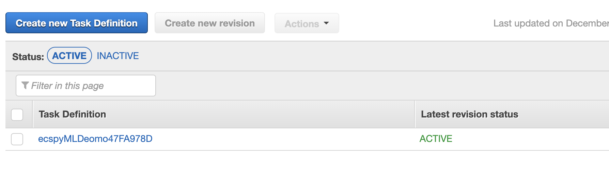

# 1 Introduction

This artifact is for using CDK to create ECS TaskRole to run machine learning tasks(both training and prediction). Using this artifact can easily build your image and push it to ECR and use this image to run your machine learning task.

The ECS task will first download dataset from input s3 and then run the python code to train a model. After training, the model will be saved into output s3 bucket.

The CDK code created following services:

- S3 bucket: input bucket(for dataset) & output bucket(for model)
- ECR image: storage of runtime for machine learning code
- Task Definition of ECS: Definition for ECS task, including the containers, CMD, image uri in ECR and etc..
- Cluster: The virtual cluster for ECS task to run
- Default Role for ECS: Give ECS tasks access to S3 buckets, please change it according to your task.

Notes:
1. Make sure you have an VPC, because you will specify an VPC when start the ECS task.
2. You need to change the code in docker/code/run.sh according to the name of buckets created by cdk.

# 2 Steps

## 2.1 Install Node.js, npm and CDK


Download node.js

```shell
wget https://nodejs.org/dist/v16.13.1/node-v16.13.1-linux-x64.tar.xz
```


Copy node.js to` /usr/local/lib/node.js`

```shell
sudo mkdir -p /usr/local/lib/nodejs
tar xvf node-v16.13.1-linux-x64.tar.xz 
sudo mv node-v16.13.1-linux-x64/ /usr/local/lib/nodejs/node-v16.13.1-linux-x64/
```


Edit `/etc/profile` to add following line at the end of txt

```shell
export PATH=/usr/local/lib/nodejs/node-v16.13.1-linux-x64/bin:$PATH
```


Edit `/etc/sudoers` to add following content to the `secure_path` variable

```shell
/usr/local/lib/nodejs/node-v16.13.1-linux-x64/bin:
```


Logout and then login again, and then install CDK


```shell
sudo npm install -g aws-cdk

cdk --version
```

## 2.2 Run CDK

In the root path of this artifact run:

```shell
cdk bootstrap
```

And then run:

```shell
cdk deploy
```

Then you will see the Task Definition in the AWS console:



## 2.3 Run Task

Use following script can start the ECS Task, you need to specify subnets and security groups.

```python
import json
import boto3

client = boto3.client('ecs')

cluster = 'cluster-name'
task_name = 'task-definition-name' 
subnets = ['subnet-xxx']
security_groups = ['sg-xxx']

response = client.run_task(
        cluster=cluster,
        taskDefinition=task_name,
        count=1,
        launchType='FARGATE',
        networkConfiguration={
            'awsvpcConfiguration': {
                'subnets': subnets,
                'securityGroups': security_groups,
                'assignPublicIp': 'ENABLED'
            }
        }
)

```
# 3 Another method of creating ECS with Python code:
There is another method of creating ECS TaskDefinition with Python code, but need you manually build and push images to ECR, and create task role and execution role

- `task_name`：name of task definition
- `log_group_name`: Task log group
- `stream_prefix`: prefix of log group stream
- `cmd`: entry point
- `image`: ECR uri(build beforehands)
- `task_role_arn`和`execution_role_arn`: (build beforehands)
- `cpu`：cpu numbers
- `memory`：memory numbers

```python
import boto3

task_name = 'test-task-name' 

log_group_name = '/xxx-ecs/test-ecs-log' 
region = 'us-east-1'
stream_prefix = 'ecs'

cmd = ['./run.sh', 'param1', 'param2']
image = '123456.dkr.ecr.us-east-1.amazonaws.com/ecr/docker-name' 
task_role_arn = 'xxx' 
execution_role_arn = 'xxx'
cpu = str(4096)
memory = str(30720)

client = boto3.client('ecs')

response = client.register_task_definition(
    family=task_name,
    taskRoleArn=task_role_arn,
    executionRoleArn=execution_role_arn,
    networkMode='awsvpc',
    containerDefinitions=[
        {
            'name': 'container1',
            'image': image,

            'command': cmd,
            
            'logConfiguration': {
                'logDriver': 'awslogs',
                'options': {
                    'awslogs-region' : region,
                    'awslogs-group' : log_group_name,
                    'awslogs-stream-prefix': stream_prefix
                }
            },

        }, 
    ], 
    requiresCompatibilities=[
        'FARGATE',
    ],
    cpu=cpu,
    memory=memory
)
```